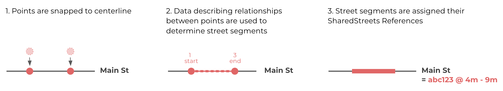
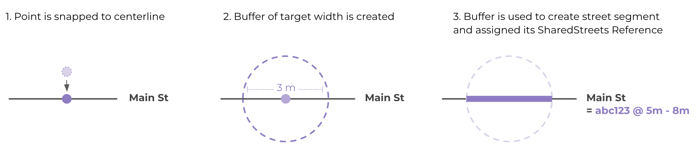

# About location

For each curb regulation, CurbLR contains a [GeoJSON feature geometry](GeoJsonGeometry.md) as well as JSON fields that describe the location with respect to the street. This page focuses on the latter.

Curb regulations always apply to a linear segment of the street edge. Therefore, CurbLR requires location information to be stored as street segments: features that refer to a particular street and direction of travel, and which have a start and an end point. This enables producers and consumers to communicate clearly about where a [Regulation](Regulations.md) applies.

## Using linear referencing

Since curb regulations apply to a segment of the street, sign posts and zones most reference a particular street and their location along it.

Doing this requires a standard referencing system that works across jurisdictions. The [SharedStreets Referencing System](https://sharedstreets.io/how-the-sharedstreets-referencing-system-works/) provides an open, non-proprietary method for identifying street segments and integrating multiple underlying basemaps into a single shared referencing system. CurbLR includes SharedStreets References to provide a truly common way to talk about both a place on the curb and the rules that apply in that place.

The [SharedStreets command line interface](https://github.com/sharedstreets/sharedstreets-js) enables users to generate linear references for input data before converting it into the CurbLR format.

## Converting point-based data into street segments

In addition to referencing a particular street and side of the street, curb regulations must also have a start and end location. In the physical world, curb regulations are often marked as points, such as parking signs or meters. For this reason, agencies often collect and store point-based data about the curb and the assets used to communicate regulations to the public. SharedStreets has created data processing tools that can be used to convert point-based asset data into segments with a certain length.

The point-to-street-segment tools are part of the [SharedStreets command line interface](https://www.github.com/sharedstreets/sharedstreets-js). They enable users to snap points to the street and convert them into street segments in multiple ways:

1. _By determining relationships between signs_. Regulations are often indicated by multiple signs along the same street. With this method, each input data point is assigned a value to indicate whether it is the beginning (`1`), middle (`2`), or end (`3`) of a regulation. The processing tools examine each individual street to identify points that describe the same regulation, then use the point relationships to turn these points into a street segment. This method is the preferred, most precise method and it is recommended for any new data collection. Here's an overview of the process:

2. _Using a fixed-width or variable-width buffer_. If a city only has point-based data, then the length of the regulation must be extrapolated/estimated. Certain assets, like parking meters, often have a typical length. The approximate length of each feature can be set in the input data and used to generate a street segment. Or, a fixed-width buffer can be used, where all points are assigned the same length (though this is the least common scenario and should only be used if appropriate). Overlapping street segments with the same regulation information will be combined into one street segment. Here's an overview of the buffer process:

The tools can also use a combination of methods, determined by how much data is available for each point. Sign relationships would be given priority, followed by fixed-buffer width, followed by a fallback buffer size.

# Definition

Each feature in the GeoJSON should contain the following Location properties:

| Field name | Importance  | Type | Description | Example |
| :---: | :--- | :--- | :--- | :--- |
| shstRefId | Required | `string` | An alphanumeric hash generated by the [SharedStreets Referencing System](https://sharedstreets.io/how-the-sharedstreets-referencing-system-works/), which refers to the street segment and its direction. This provides a common, non-proprietary way to identify a street and can be used to link city and private datasets | `592c2106e6553d3c930a372763f10254` |
| sideOfStreet | Required | `enum` (`string`) Values: `left`, `right`, `unknown`  | Side of street that the curb regulation applies to, relative to the direction of digitization. Note that each direction of travel has a left and a right side. Thus, a one-way street will have one reference ID with a left and a right side. A two-way street will have two reference IDs, each with a left and a right side. | `left` |
| shstLocationStart | Required | `float` | Where the regulation starts. Given as the distance (in meters) along the street, in the direction of digitization | `80.2` |
| shstLocationEnd | Required | `float` | Where the regulation ends. Given as the distance (in meters) along the street, in the direction of digitization | `95.3` |
| objectId | Optional (Recommended) | `string` |  Optional identifier for the regulation geometry. Enables CurbLR data to be linked back to input asset data, can be used by applications looking to model changes or future scenarios. These may have logic to them, or may be arbitrary feature ID's generated by the creator of the feed. | `440235`
| derivedFrom | Optional (Recommended) | array of `string` | An optional array that holds object IDs that correspond to the physical assets used to derive the feature geometry (e.g. object ID for signposts, meters). Enables CurbLR data to be linked back to input asset data in GIS. Also useful when converting GIS data into CurbLR, for pre-processing and linear referencing steps. | `[3455, 1359]`|
| assetType | Required | `string` Suggested values: `bicycle rack` (optional `assetSubtype` = `bike share`), `bollards`, `bus stop`, `crosswalk`, `curb cut` (optional `assetSubtype` = `ramp`, `driveway`, `street`), `curb extension`, `curb paint` (requires `assetSubtype` to describe the color of the paint, e.g. `red`), `fence`, `hydrant`, `pavement marking` (optional `assetSubtype` = `bicycle`, `bus`, `taxi`, `arrow`, `diagonal lines`, `zigzag`, `parallel parking spaces`, `perpendicular parking spaces`, `yellow`, `red`, `blue`, `ISA`), `parking meter` (optional `assetSubtype` = `single`, `double`, `multi-space`), `sign` | Describes the feature that marks the regulation on the street, likely the asset that was mapped to generate the input data for CurbLR. This can be used to indicate what a human curb user should look for in order to verify parking directions from an app or other product. For curb paint, colors are included for clarity. For more information, see the [source of this well-known values list](https://github.com/coordcity/open-curb-assets/blob/master/open-curb-assets-spec.md#asset-types-and-subtypes) | `sign` |
| assetSubtype | Optional | `string`. Suggested values listed above, under `assetType`. For more information, see the [source of this well-known values list](https://github.com/coordcity/open-curb-assets/blob/master/open-curb-assets-spec.md#asset-types-and-subtypes) | Certain asset types may contain a subtype to further categorize them. | `yellow` |
| baysAngle | Optional (Recommended) | `enum` (`string`) Values: `parallel`, `perpendicular`, `diagonal` | Describes the angle of parking/loading/standing spaces. Could be used to approximate the number of parking spaces (and estimate availability) in a street section | `parallel` |
| baysCount | Optional | `int` | The number of parking/loading/standing bays demarcated in a street section. Could be used to estimate parking availability | `5` |
| streetName | Optional | `string` | Optional field to store the name of the street, with the intent of surfacing this information to end users or facilitations QA/QC of the data | `Main St`|
| status | Optional | `enum` (`string`) Values: `active`, `planned`, `proposed` | Can be used to indicate whether this curb regulation currently exists (`active`), is planned or scheduled to take place in the future (`planned`), or is proposed for consideration (`proposed`). If not specified, a regulation will be assumed to be `active`; it is not necessary to include this location property for active regulations, though there may be instances where users wish to specify status for extra clarity. | `planned` |

Data fields should generally be considered case insensitive since they are used programmatically; we use lower-case in our examples, except for fields that would be used for display purposes (such as a street name or agency name).

# Examples

The links below show real world curb regulations translated into CurbLR.

| Link | Description |
| :---- | :---- |
| [Examples of simple regulations](examples/simple_examples.md) | Simple regulatory scenarios typically involving one or two basic restrictions  |
| [Examples of complex regulations](examples/complex_examples.md) | Complex regulatory scenarios typically involving several restrictions  |
| Sample of [downtown Portland's parking regulations](/conversions/Portland/portland_2020-02-20.curblr.json) | Contains data for about 3 miles of parking regulations, surveyed in November 2019. This can also be viewed at [demo.curblr.org](https://demo.curblr.org)
