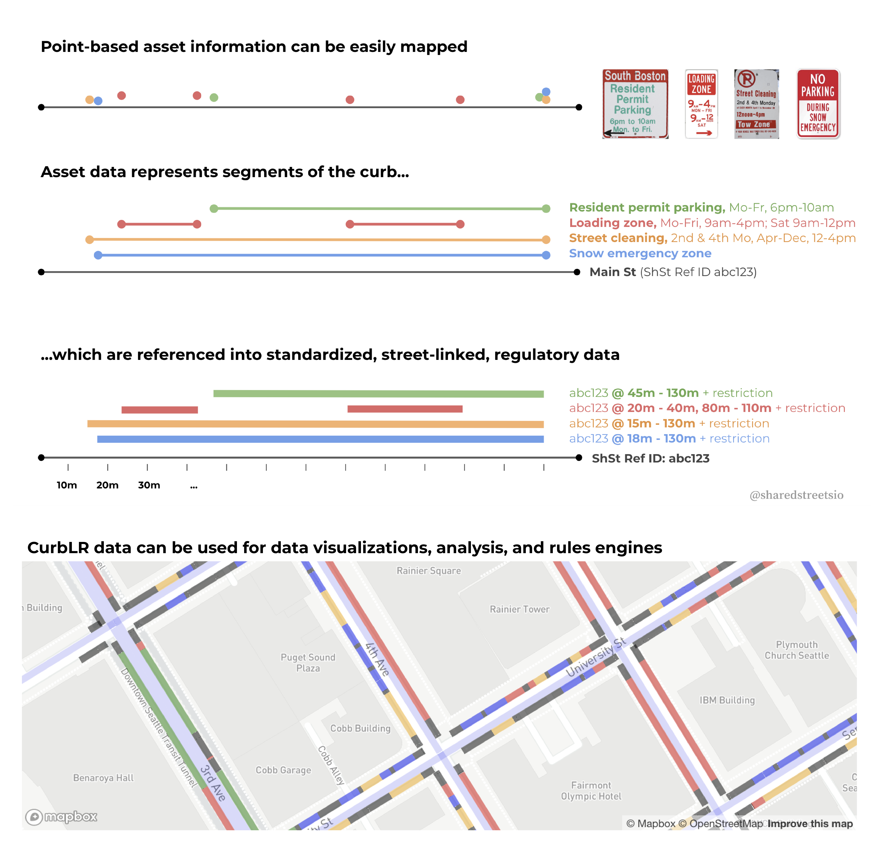
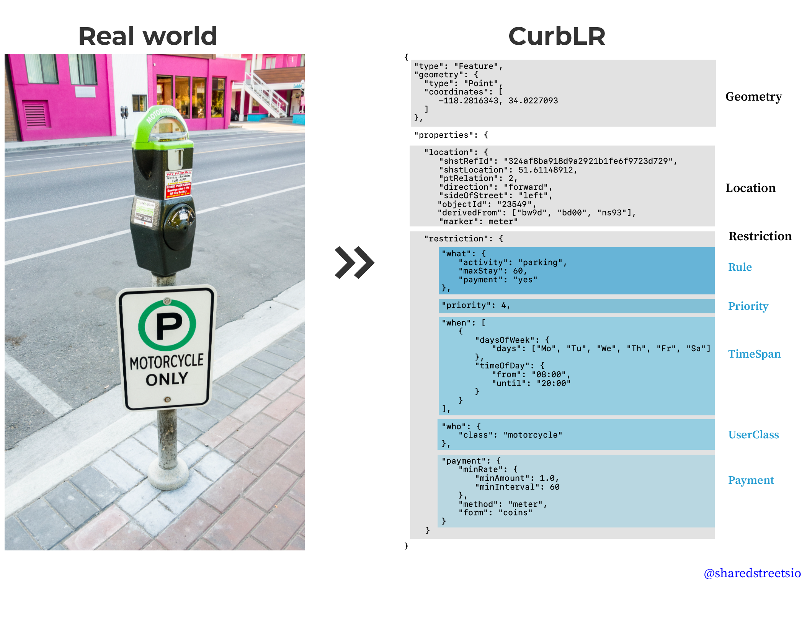

# What is CurbLR?
CurbLR is a data standard for describing urban curb regulations. It exists to help government effectively manage and regulate the curb and to support public and private users of city streets.

CurbLR provides a structured, standardized format that can be used by government agencies, citizens, and companies who want to store and share information about curb regulations, regardless of whether the data are gathered through mapping, crowdsourcing, or machine learning techniques. It uses linear referencing to link regulation information back to the street.

CurbLR is a common language on which many things can be built, including rules engines, query APIs, consumer notification services, mapping tools, and analytic models.

# Design principles
1. ***Machine-readable:*** From navigation apps to connected cars, urban mobility is increasingly digital. CurbLR helps computers understand the curb, whether that's answering real-time questions like "where's the nearest place to drop off a passenger?" or modeling parking allocation scenarios for an entire neighborhood.

1. ***Human-accessible:*** Curbs are managed and used by people, so CurbLR must be useful to humans and not just machines. CurbLR is designed to be directly readable and writable by people with technical training, and to support tools that make it accessible to the non-technical.

1. ***Achievable:*** Most curb management is not digitized today and this won't change overnight. To ease this transition, it must be possible to take existing signs and translate them into CurbLR, even if some desired data fields are unknown.

1. ***Adaptable:*** No two cities manage their curb in exactly the same way. CurbLR is built to support many types of regulations and management practices. A city should not have to change its curb regulations to use CurbLR.

1. ***Essential but not exhaustive:*** CurbLR is not the appropriate place to store exhaustive information that would not be consumed by others outside the city (for example, the date when a parking sign was last replaced). This information can be maintained separately and linked to the curb regulation data - in the same way that GTFS contains essential information about a transit system, but doesn't capture every bit of the transit agency's data.

1. ***Reversible:*** Cities can convert parking regulations into a CurbLR feed, and can also reverse this to link back to their original data.

1. ***Consumption-oriented:*** Government agencies typically maintain data about physical assets, which are easily managed in GIS systems and are the simplest format for an agency to update over time. CurbLR describes regulatory geometries, which requires a more complicated data model and a GeoJSON format. In order to fully capture essential data, the spec is difficult to edit and maintain directly in a GIS system. Therefore, CurbLR is intended as a format for cities to publish and share curb regulation data with outside agencies or private companies. The structure and details of the spec follow this logic. In addition, since public agencies producing data often have fewer technical resources than private companies consuming data, CurbLR strives to avoid burdensome data requirements for cities by focusing on basic asset data. Wherever possible, CurbLR avoids data processing and interpolation, leaving these issues for engineering teams on the consumption side of the workflow.

1. ***B2B-oriented:*** CurbLR is intended as a format for cities to share data that can be used in routing apps, payment services, visualization and analysis tools, etc. It is intended as a B2B exchange format, with the assumption that each individual service or app would choose its own means to store, integrate, query, and serve out the data to end users. To make this simple, we kept CurbLR as a single file with a denormalized structure. We chose not to break CurbLR into multiple files, like GTFS, that require a database structure to interpret. Ultimately we decided that the burdens for consumers working with denormalized data outweighed the desire to keep file sizes small and avoid repetition. We recognize that some may disagree with this design decision, but it was made with careful consideration.

1. ***Future-friendly:*** How we use the curb is changing. Cities are adjusting parking prices based on demand, new transportation services are arriving on our streets, and vehicles without humans behind the wheel will one day deliver people and goods to the curb. CurbLR exists to help make these futures a reality and will grow and adapt as urban mobility evolves.

# Approach

CurbLR structures every curb regulation as having three components: the [GeoJSON feature](GeoJsonGeometry.md), the [location properties](Location.md), and the [regulation](Regulations.md) that applies. While the regulation is relatively straightforward to describe, location is more difficult.

Curb regulations are usually represented by physical assets like parking signs and curb markings that describe where the regulation applies. These signs can be mapped using their geographic coordinates.

The assets themselves are easy to map, but the concepts they represent are not. Curb regulations don’t have a perfect, 1:1 relationship with physical space. They represent **regulatory geometries**, not physical geometries.

CurbLR uses asset data as the building blocks for a spec, but supplements it with additional location information and structure.

CurbLR requires users to reference asset data to their location along a street, using the SharedStreets Referencing System. Individual asset locations are given the SharedStreets Reference ID for the street on which they are located, along with their location along it. Points can be extrapolated into line segments by setting a particular width for each type of regulation, by including information about sign relationships along a street, or by estimating based on similar metadata. This enables asset-based point or line data to be converted into street-linked data.

Here's a visual overview:

SharedStreets references can be regenerated at any time, and individual assets can be edited without impacting the rest of the data. This provides a stable, interoperable way to convert the location of a parking sign into the regulatory geometry that it represents.

With location taken care of, the rest of a curb regulation is relatively straightforward to describe, using categories to capture what, where, to whom, and how the regulation should be applied.

# Examples
The links below show real world curb regulations translated into CurbLR.

| Link | Description |
| :---- | :---- |
| [Examples of simple regulations](examples/simple_examples.md) | Simple regulatory scenarios typically involving one or two basic restrictions  |
| [Examples of complex regulations](examples/complex_examples.md) | Complex regulatory scenarios typically involving several restrictions  |
| Large dataset of [Los Angeles' parking regulations, translated into CurbLR](/conversions/LA_CurbLR.json) | Contains data from 35,000 parking signs, many with multiple complex regulations. [Raw data](https://geohub.lacity.org/datasets/71c26db1ad614faab1047cc8c3686ece_28) was accessed through LA's open data portal, matched to the SharedStreets Referencing System, cleaned into a [CurbLR-ready CSV](/conversions/prepped_data.csv), and [converted](/js) into CurbLR's JSON format.

# Data model

CurbLR groups regulations into several categories, focusing on **where** the regulation occurs, **what** it restricts or permits, **when**, **to whom**, and **how**, it applies, and how it relates to overlapping regulation.

These categories are described below:

| Category | Importance | Description |
| :---- | :---- | :---- |
| [Manifest](Manifest.md) | Required | Contains metadata properties that apply to all regulations, such as the date when the feed was created |
| [GeoJSON feature](GeoJsonGeometry.md) | Required | Describes the street segment as it will appear on a map. All GeoJson features are LineStrings containing coordinates and the fields listed below in this table. |
| GeoJsonProperties.[Location](Location.md) | Required | Describes the location (street-linked point or street segment) **where** the regulation applies, using geographic information and linear referencing. |
| GeoJsonProperties.[Regulations](Regulations.md) | Required | Describes the curb usage regulation(s) that are in place for the location |
| GeoJsonProperties.Regulations.[Rule](Rule.md) | Required | Determines **what** is allowed or forbidden in the zone during a particular period of time |
| GeoJsonProperties.Regulations.[UserClasses](UserClasses.md) | If applicable | Defines **who** the regulations applies to. Can be used to denote categories of users such as permit holders, vehicle types, or vehicle function |
| GeoJsonProperties.Regulations.[TimeSpans](TimeSpans.md) | If applicable | Defines the time period **when** a zone regulation is in effect |
| GeoJsonProperties.Regulations.[Payment](Payment.md) | Optional | Provides a structure to store additional information about fees that may be required in order to use a given curbspace |
| GeoJsonProperties.Regulations.[Priority](Priority.md) | Required | Defines how overlapping regulations relate to one another (i.e. which one takes **priority**)

The feed as a whole is a JSON file. The curb geometries and properties are stored as GeoJSON features that form one GeoJSON object. Above this in the file, the CurbLR feed will contain metadata properties, stored as a [manifest](Manifest.md), which is a JSON object.

The example below shows the structure of one feature in the feed:

# Origins
CurbLR is based on the design and thinking laid out in [CurbSpec](https://github.com/jfh01/CurbSpec). At SharedStreets, we spoke with a handful of cities across the US, reviewed their parking regulation datasets, conducted field mapping in a local area to experience data collection, and converted an [initial dataset of ~35,000 Los Angeles parking zones](/conversions) into the CurbSpec format. To our knowledge, this was the first attempt to convert a curb regulation dataset into CurbSpec. When trying to convert GIS data into the spec, we realized that several significant modifications were needed, including:
- Adding location information for the regulation (both geographic and with the [SharedStreets linear referencing system](https://sharedstreets.io/how-the-sharedstreets-referencing-system-works/).
- Structuring regulations as a GeoJSON object, and in a flatter manner (one curb activity per feature)
- Using a well-known values approach to avoid free-form text where possible
- Adding metadata to describe the agency that created the data, and other relevant aspects that apply across a CurbLR feed
- Adding a structured, but optional, place for data such as payment information and asset information, which is required for some consumption efforts

The addition of linear-referenced location information was a significant change that is critical to how the spec functions. Because of this change, we chose to rename this spec as CurbLR.

# Potential future enhancements
* **External referencing for designated periods**: Extend [TimeSpan](TimeSpans.md) to allow arbitrarily designated periods (e.g. "Snow Emergency" or "School Days") to be specifically defined via a static or dynamic (API) referencing system

* **Transactional data**: Structure to facilitate the inclusion of transaction or session data

* **Cross-jurisdictional allowed use mapping**: A mechanism to establish defaults and translate [Regulations](Regulations.md) (which are locally defined in their meaning) into a standardized, cross-jurisdictional list of activities. This would, for example, allow automated interpretation of local regulations to determine where activities like passenger loading could take place.
