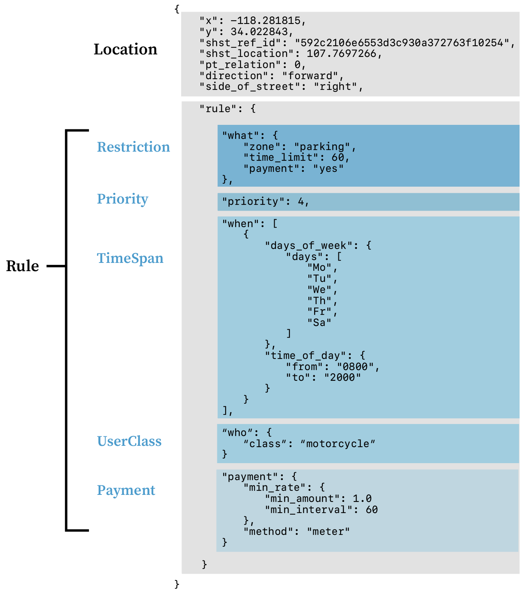

# Origins
CurbLR is based on the design and thinking laid out in [CurbSpec](https://github.com/jfh01/CurbSpec). At SharedStreets, we spoke with a handful of cities across the US, reviewed their parking regulation datasets, conducted field mapping in a local area to experience data collection, and converted an [initial dataset of ~35,000 Los Angeles parking zones](/conversions) into the CurbSpec format. To our knowledge, this was the first attempt to convert a curb regulation dataset into CurbSpec. When trying to convert GIS data into the spec, we realized that several significant modifications were needed, including:
- Adding location information for the regulation (both geographic and with the [SharedStreets linear referencing system](https://sharedstreets.io/how-the-sharedstreets-referencing-system-works/).
- Structuring the JSON in a flatter manner (one curb zone per object)
- Using a well-known values approach to avoid free-form text where possible
- Adding a structured, but optional, place for non-essential data such as payment information and asset information

The addition of linear-referenced location information was a significant change that is critical to how the spec functions. Because of this change, we chose to rename this spec as CurbLR.

# What is CurbLR?
CurbLR is a data standard for describing urban curb regulations. It exists to help government effectively manage and regulate the curb and to support public and private users of city streets.

CurbLR provides a structured, standardized format that can be used by government agencies, citizens, and companies who want to store and share information about curb regulations, regardless of whether the data are gathered through mapping, crowdsourcing, or machine learning techniques. It uses linear referencing to link regulation information back to the street.

CurbLR is a common language on which many things can be built, including rules engines, query APIs, consumer notification services, mapping tools, and analytic models.

CurbLR is stored in JSON format.

# Design principles
1. ***Machine-readable:*** From navigation apps to connected cars, urban mobility is increasingly digital. CurbLR helps computers understand the curb, whether that's answering real-time questions like "where's the nearest place to drop off a passenger?" or modeling parking allocation scenarios for an entire neighborhood.

1. ***Human-oriented:*** Curbs are managed and used by people, so CurbLR must be useful to humans and not just machines. CurbLR is designed to be directly readable and writable by people with technical training, and to support tools that make it accessible to the non-technical.

1. ***Reversible:*** Most curb management is not digitized today and this won't change overnight. To ease this transition, it must be possible to take existing signs and translate them into CurbLR, and to use CurbLR to generate a hypothetical physical signage plan.

1. ***Adaptable:*** No two cities manage their curb in exactly the same way. CurbLR is built to support many types of regulations and management practices. A city should not have to change its curb regulations to use CurbLR.

1. ***Essential but not exhaustive:*** CurbLR is not the appropriate place to store exhaustive information that would not be consumed by others outside the city (for example, the date when a parking sign was last replaced). This information can be maintained separately and linked to the curb regulation data - in the same way that GTFS contains essential information about a transit system, but doesn't capture every bit of the transit agency's data.

1. ***Future-friendly:*** How we use the curb is changing. Cities are adjusting parking prices based on demand, new transportation services are arriving on our streets, and vehicles without humans behind the wheel will one day deliver people and goods to the curb. CurbLR exists to help make these futures a reality and will grow and adapt as urban mobility evolves.

# Approach

CurbLR structures every curb regulation as having two components: the location, and the rule that applies. While the rule is relatively straightforward to describe, location is more difficult.

Curb rules are usually represented by physical assets like parking signs and curb markings that describe where the rule applies. These signs can be mapped using their geographic coordinates.

The assets themselves are easy to map, but the concepts they represent are not. Curb regulations don’t have a perfect, 1:1 relationship with physical space. They represent **regulatory geometries**, not physical geometries.

CurbLR uses asset data as the building blocks for a spec, but supplements it with additional location information and structure.

CurbLR requires users to reference asset data to their location along a street, using the SharedStreets Referencing System. Individual asset locations are given the SharedStreets Reference ID for the street on which they are located, along with their location along it. Points can be extrapolated into line segments by setting a particular width for each type of restriction, by including information about sign relationships along a street, or by estimating based on similar metadata. This enables asset-based point or line data to be converted into street-linked data.

Here's a visual overview:

SharedStreets references can be regenerated at any time, and individual assets can be edited without impacting the rest of the data. This provides a stable, interoperable way to convert the location of a parking sign into the regulatory geometry that it represents.

With location taken care of, the rest of a curb regulation is relatively straightforward to describe, using categories to capture what, where, to whom, and how the rule applies, as shown in the example below:

# Examples
The links below show real world curb regulations translated into CurbLR.

| Link | Description |
| :---- | :---- |
| [Examples of simple regulations](examples/simple_examples.md) | Simple regulatory scenarios typically involving one or two basic rules  |
| Large dataset of [Los Angeles' parking regulations, translated into CurbLR](/conversions/LA_CurbLR.json) | Contains data from 35,000 parking signs, many with multiple complex regulations. [Raw data](https://geohub.lacity.org/datasets/71c26db1ad614faab1047cc8c3686ece_28) was accessed through LA's open data portal, matched to the SharedStreets Referencing System, cleaned into a [CurbLR-ready CSV](/conversions/prepped_data.csv), and converted into JSON format using [Jupyter](https://github.com/sharedstreets/CurbLR/blob/master/conversions/CSV%20to%20JSON%20parking%20rules.ipynb).

# Data model

CurbLR groups data into several categories, focusing on **where** the restriction occurs, **what** it restricts, **when**, **to whom**, and **how**, it applies, and how it relates to overlapping restrictions. Each object in the JSON may contain the following properties, organized in order of importance:

| Category | Importance | Description |
| :---- | :---- | :---- |
| [Location](Location.md) | Required | Describes the location (zone) **where** the restriction applies, using geographic information and linear referencing |
| [Restriction](Restriction.md) | Required | Determines **what** is allowed or forbidden in the zone during a particular period of time |
| [Priority](Priority.md) | Recommended | Defines how overlapping zone restrictions relate to one another (i.e. which one takes **priority**) |
| [TimeSpan](TimeSpan.md) | If applicable | Defines the time period **when** a zone regulation is in effect |
| [UserClass](UserClass.md) | If applicable | Defines **who** the restriction applies to. Can be used to denote categories of users such as permit holders, vehicle types, or vehicle function |
| Additional categories: (**[Payment](Payment.md)**) | Optional | Provides a structure to store additional information about **how** the rules are applied, such as payment profiles. Additional categories, such as asset information, could be added if needed

The [location](Location.md) fields are object-level properties of the JSON. The remaining fields form part of the [rule](Rule.md) that applies to the object. The example below shows the structure of the JSON, using an example from the Los Angeles data:

# Future enhancements
* **External referencing for designated periods**: Extend [TimeSpan](TimeSpan.md) to allow arbitrarily designated periods (e.g. "Snow Emergency" or "School Days") to be specifically defined via a static or dynamic (API) referencing system.

* **Enhanced payment definition**: A schema to define payment requirements for a given use. Could support the publishing of dynamic parking pricing or complex fee structures such as peak period ride share pickup / drop-off fees.

* **Cross-jurisdictional allowed use mapping**: A mechanism to establish defaults and translate [Rules](Rule.md) (which are locally defined in their meaning) into a standardized, cross-jurisdictional list of activities. This would, for example, allow automated interpretation of local rules to determine where activities like passenger loading could take place.
