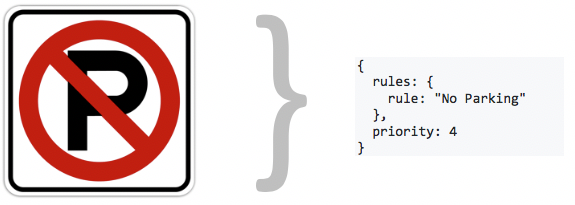

# What is CurbSpec?
CurbSpec is a data standard for describing urban curb regulations. It exists to help government effectively manage and regulate the curb and to support public and private users of city streets.

CurbSpec is a common language on which many things can be built, including rules engines, query APIs, consumer notification services, mapping tools, and analytic models.

# Design Principles
1. ***Machine-readable:*** From navigation apps to connected cars, urban mobility is increasingly digital. CurbSpec helps computers understand the curb, whether that's answering real-time questions like "where's the nearest place to drop off a passenger?" or modeling parking allocation scenarios for an entire neighborhood.

1. ***Human-oriented:*** Curbs are managed and used by people, so CurbSpec must be useful to humans not just machines. CurbSpec is designed to be directly readable and writable by people with technical training, and to support tools that make it accessible to the non-technical.

1. ***Reversible:*** Most curb management is not digitized today and this won't change overnight. To ease this transition, it must be possible to take existing signs and translate them into CurbSpec, and to use CurbSpec to generate a hypothetical physical signage plan.

1. ***Adaptable:*** No two cities manage their curb in exactly the same way. CurbSpec is built to support many types of regulations and management practices. A city should not have to change its curb regulations to use CurbSpec.

1. ***Future-friendly:*** How we use the curb is changing. Cities are adjusting parking prices based on demand, new transportation services are arriving on our streets, and vehicles without humans behind the wheel will one day deliver people and goods to the curb. CurbSpec exists to help make these futures a reality and will grow and adapt as urban mobility evolves.

# Examples
The pages below show real world curb regulations translated into CurbSpec.

| | |
| :---- | :---- |
| [Examples of Simple Regulations](examples/simple_examples.md) | Simple regulatory scenarios typically involving one or two basic rules  |
| [Examples of Complex Regulations](examples/complex_examples.md) | Complex scenarios that address multiple user classes, complicated expressions of time, and overlapping regulations |

# Data Model
| Object | Description |
| :--- | :--- |
| ***[Regulation](Regulation.md)*** | A given location or segment of curb may have one or more regulations that determine what is allowed or forbidden during a particular period of time |
| ***[Rule](Rule.md)*** | A [Regulation](Regulation.md) may have one or more rules that define what particular curb users can and cannot do when the [Regulation](Regulaton.md) is in effect |
| ***[Timespan](TimeSpan.md)*** | Defines the time period when a [Regulation](Regulation.md) is in effect. |
| ***[UserClass](UserClass.md)*** | Defines a category of curb user. Can be used to denote permit holders, vehicle types, or vehicle function. |

# About Location
CurbSpec provides a mechanism to describe curb regulation, but it does not specify how to talk about location (e.g. how to identify a specific stretch of curb). Location is highly context dependent and CurbSpec is designed to work with various approaches and use cases, rather than to prescribe a one-size-fits-all solution.

For example, a company might develop an API that takes a point location (lat/lon) and returns the applicable CurbSpec that applies to the stretch of curb on which the point falls. In this case, no external location referencing system is needed.

Alternatively, a City might apply CurbSpec on top of its proprietary linear referencing system to keep an internal database of signage and regulations.

However, it will be hard to unlock the full potential of digitizing urban curb regulation without a standard referencing system that works across jurisdictions. The [SharedStreets Reference System](https://github.com/sharedstreets/sharedstreets-ref-system) provides an open, non-proprietary method for identifying street segments and integrating multiple underlying basemaps into a single shared referencing system. CurbSpec can be used in conjunction with Shared Streets References to provide a truly common way to talk about both a place on the curb and the rules that apply in that place.

# Future Enhancements
* **External referencing for designated periods**: Extend [TimeSpan](TimeSpan.md) to allow arbitrarily designated periods (e.g. "Snow Emergency" or "School Days") to be specifically defined via a static or dynamic (API) referencing system.

* **Enhanced payment definition**: A schema to define payment requirements for a given use. Could support the publishing of dynamic parking pricing or complex fee structures such as peak period ride share pickup / drop-off fees.

* **Cross-jurisdictional allowed use mapping**: A mechanism to translate [Rules](Rule.md) (which are locally defined in their meaning) into a standardized, cross-jurisdictional list of activities. This would, for example, allow automated interpretation of local rules to determine where activities like passenger loading could take place.
