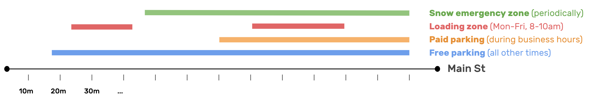
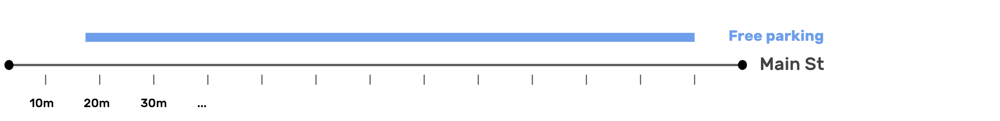
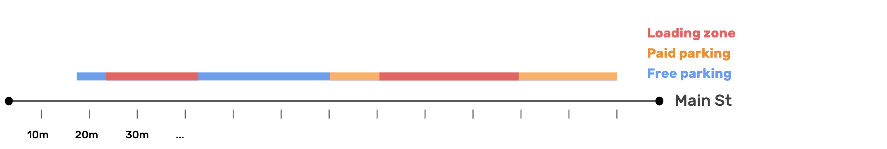
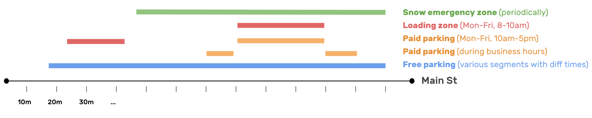

# About rules
A rule is a subsection of the [regulations](Regulations.md). It groups properties that define _what_ activity is allowed or prohibited at a section of curb, _why_, and pertinent information about _how_ the regulation applies (whether there is a time limit or maximum time before returning). Additional object properties grouped elsewhere in the spec further define [_when_](TimeSpan.md) and [_to whom_](UserClasses.md) the regulation applies, whether and how much [payment](Payment.md) is required, as well as the [_priority_](Priority.md) level of the regulation.

# Definition
Each GeoJSON feature may have the following properties:

| Field name | Importance  | Type | Description | Example
| :--- | :--- | :--- | :--- | :--- |
| activity | Required | `enum` (`string`) Values: `parking`, `no parking`, `standing`, `no standing`, `loading`, `no loading` | Describes what activity is forbidden or permitted | `parking` |
| priorityCategory | Required | `string` Suggested values; see below | Assigns a simple, descriptive label to the regulation, often based on the activity or date properties. This describes why the activity rule is in place. All unique `priorityCategory` values in a CurbLR feed must be listed in a prioritized order in the [metadata](Manifest.md). This list creates a hierarchy that can be used to determine which regulation takes precedence when there are overlapping rules. The [metadata](Manifest.md) includes an example ordered list. | `game day` |
| maxStay | Optional | `int` | The length of time (in minutes) for which the curb may be used under this regulation. This provides a time restriction, in addition to any [TimeSpan](TimeSpans.md) restrictions | `30`
| noReturn | Optional | `int` | The length of time (in minutes) that a user must vacate the curbspace before allowed to return for another stay. Generally applies only to regulations with a `maxStay` | `60`|
| payment | Optional | `boolean` Default value: `false` | `true` indicates that payment is required. This field is not necessary if no payment is required. Additional payment information is stored in [Payment](Payment.md)| `true`|
| authority | Optional object used as override for exceptions | An agency producing CurbLR data can indicate, in the [metadata](Manifest.md), which authority has jurisdiction over the curbspace in the data (i.e. who created and manages the regulation). Often, this will be consistent across all data in a CurbLR feed. However, this property can also be set for each individual feature geometry, and is intended to store exceptions that override the authority set in the metadata.
| authority.name | Optional override | `string` (web link) | Name of agency | `City of London`
| authority.url | Optional override | `string` (web link) | Link to the regulatory agency's domain | `https://vancouver.ca`
| authority.phone | Optional override | `string` (`E.164 format`: + `country code` + `local area code` + `phone number`) | The phone number,  including country and area code, for the regulatory agency that could be contacted about parking regulations | `+15551231234`

Data fields should generally be considered case insensitive since they are used programmatically; we use lower-case in our examples, except for fields that would be used for display purposes (such as a street name or agency name).


It is possible for more than one regulation to apply to the same section of a street. For example, a section of curb may be a loading zone during the morning, a paid parking zone during the afternoon, and a free parking zone in the evening. A stretch of curb may be regulated for two-hour parking normally, but during a snow emergency that regulation is superseded by a no parking regulation. Or a temporary regulation might be put into place to disallow parking in a construction zone.

A priority hierarchy allows different regulations to coexist without ambiguity. When multiple regulations apply at a specific location and time, the priority hierarchy determines which one is in force.

In the real world, priorities are often implied rather than explicit. Road users assume that a "No Parking - Street Cleaning" sign overrules a "2H Meter Parking" sign. As computers are not adept at making these kinds of value judgements, CurbLR requires that priorities be specified explicitly.

Priorities also avoid the need to define the regulations for each span of curb individually. An entire street or set of streets might be regulated as resident parking, but with small spans near fire hydrants defined with higher priority "no parking" regulations applied. To resolve potential conflicts when regulations overlap one another, a descriptive priority category is included as part of each regulation, and the [metadata](Manifest.md) includes an ordered list of these priority categories, establishing a hierarchy on the street.

The priority hierarchy is included in the [metadata](Manifest.md) and should be used to resolve potential conflicts when regulations overlap one another. The default hierarchy is described below. It is based on the premise that more restrictive regulations supercede more permissive regulations, which is how a user would interpret these signs on the street. The default hierarchy will apply to most places, but can be customized if a jurisdiction differs from the norm or needs more flexibility. By defining categories and placing them in a priority order, CurbLR avoids the need to hardcode the priority level of each regulation on a street.


## Activity: possible values

CurbLR assumes that all activities along the curb fit into three categories:
* **Parking:** Stopping a vehicle and leaving it unattended
* **Standing:** Stopping a vehicle but leaving it attended
* **Loading:** Stopping a vehicle (attended or unattended) to perform a loading activity. The vehicle may remain in the curb section _only_ while the loading activity occurs.

Each of these activities can be described in the affirmative (e.g. `parking`) to denote what is permitted, or in the negative (e.g. `no parking`) to denote what is prohibited. It is not necessary to duplicate an object to define its inverse. A regulation for a certain type of user implies that no other users can perform that activity in the given curbspace (unless otherwise specified). For example, `parking` for residential permit holders implies that the curb segment is a `no parking` zone for any other users.

CurbLR can indicate what regulation is in effect at a given place and time (or that no regulation is in effect). CurbLR can also indicate a relationship between certain activities, but not others; if a section of curb is described as a standing or loading zone, this implies that parking is not permitted during that period. Beyond this, local regulation must determine what specific activities are allowed in a particular section of the curb. For example, local rules may allow for passenger loading in a "No Parking" zone but not in a "No Stopping" zone.

### Activity classification examples

The activity classifications may be modified to describe myriad activities along the curb. For example:
* Parking meters: Parking zone with required payment; fees may only apply during specified hours. Standing and loading may or may not be permitted.
* Residential permit parking: Parking zone for users with residential parking permits. Implies no parking for any other users. Standing and loading may or may not be permitted.
* Bus stop: Loading zone for buses. Implies no loading, standing, or parking for any other users.
* Taxi stand: Standing zone for taxis. Implies no loading, standing, or parking for any other users. (Note: This is different from a pick-up/drop-off zone since a vehicle may remain at a taxi stand indefinitely while waiting for a potential passenger.)
* TNC pick-up/drop-off zone: Loading zone for TNCs. Implies no loading, standing, or parking for any other users.


## Priority category: additional info and example

Regulations sometimes overlap in time and space, leading to potential ambiguity about which rule takes precedence. The `priorityCategory` exists to resolve these potential conflicts. It is used to sort regulations into categories that can then be placed into an ordered list describing which regulations take precedence over others. This will typically be a list of the `activity` types, plus some special types of rules that may appear temporarily or periodically and should be handled specially.

When regulations overlap, the more restrictive activity rule typically supercedes the less restrictive activity rule (e.g. a "No stopping" zone typically overrides a free parking area). However, cities often create temporary restrictions or regulations for special events, construction, weather emergencies, etc. These rules are often in effect for irregular or unpredictable time periods and a city may want to customize how these special rules fit into the hierarchy.

The following is a suggested but not exhaustive list of values for `priorityCategory`; this property should be customized as needed to describe a city:
- `no standing`
- `snow emergency zone`
- `construction`
- `game day`
- `special event`
- `street cleaning`
- `temporary`
- `standing`
- `no loading`
- `loading`
- `no parking`
- `paid parking` and/or `permit parking`, to be included depending on how the data is mapped and digitized (see next section)
- `parking`

All unique `priorityCategory` values in a CurbLR feed must be listed in the [metadata](Manifest.md), placed in order from highest to lowest priority. For the example above, this list would be written as `priorityHierarchy` = [`no standing`, `snow emergency zone`, `construction`, `game day`, `special event`, `street cleaning`, `temporary`, `standing`, `no loading`, `loading`, `no parking`, `paid parking`, `parking`]

### Priority categories: Visual example

Priority categories resolve overlapping, contradicting rules. They also make it easier to digitize a city's data. Here's an example of four regulations that may coexist on a street, layered on top of one another:



We assign a descriptive priority category to each, which are then ordered in the priorityHierachy as ["snow emergency zone", "loading", "paid parking", "free parking"].

When the CurbLR feed is being interpreted, it will generally be queried to see which regulation applies at a given time. Here is a view of the street at 2pm on a Tuesday, for example:



And here is the street at 9am on a Monday, for example:



In each case, the priority categories and hierarchy establish the order in which rules should be "layered" on top of one another, in the event that they overlap.

This approach also makes it easier for someone to digitize the rules on a street. For example, it may be advantageous to be able to create "free parking" zones as a default regulation that applies when no other rules are in force, and then "paid parking" zones on top. Because of the priority categories, we can simply add the full section of street where these rules apply, and add the timeSpan or other relevant details. Without priority categories, we would have to split the paid parking zone into multiple geometries with different time spans, so that there isn't conflict between the paid parking zone and the loading zone:



The same is true for the free parking zone underneath. Since the categories are flexible, cities can customize them to match how their local rules should be applied and to make their mapping process straightforward and tailored to their digitization method.


# Examples

The links below show real world curb regulations translated into CurbLR.

| Link | Description |
| :---- | :---- |
| [Examples of simple regulations](examples/simple_examples.md) | Simple regulatory scenarios typically involving one or two basic restrictions  |
| [Examples of complex regulations](examples/complex_examples.md) | Complex regulatory scenarios typically involving several restrictions  |
| Sample of [downtown Portland's parking regulations](/conversions/Portland/portland_2020-02-20.curblr.json) | Contains data for about 3 miles of parking regulations, surveyed in November 2019. This can also be viewed at [demo.curblr.org](https://demo.curblr.org)

### Simple regulation: no parking
Defines a No Parking regulation that applies to all road users. Standing and loading may or may not be permitted.
```json
{
  "rule": {
    "activity": "no parking"
  }
}
```

### Resident parking
Defines a `regulation` to allow people with a Zone 4 Resident Parking Permit to park. Implies no parking for any other users. Standing and loading may or may not be permitted.
```json
{
  "rule": {
    "activity": "parking",
    "priorityCategory": "paid or user-restricted parking"
  },
  "userClasses": [
    {
      "classes": ["resident permit"],
      "subclasses": ["zone 4"]
    }
  ]
}
```

### Time-limited handicap space
Defines a `regulation` that allows parking for handicap users with a 3 hour time limit.
```json
{
  "rule": {
    "activity": "parking",
    "priorityCategory": "paid or user-restricted parking",
    "maxStay": 180
  },
  "userClasses": [
    {
      "classes": ["handicap"]
    }
  ]
}
```

### Parking with time limit, users must leave for 30 minutes before being allowed to return
Defines a `restriction` that allows anyone to park for up to two hours with payment, with a max stay of two hours, after which the user must leave for at least 30 mins
```json
{
  "rule": {
    "activity": "parking",
    "priorityCategory": "parking",
    "maxStay": 120,
    "noReturn": 30
  }
}
```

### Taxi stand
Defines a `regulation` that allows taxis to stand and pick up passengers. Implies that no other users may park or stand here.
```json
{
  "rule": {
    "activity": "standing",
    "priorityCategory": "standing"
  },
  "userClasses": [
    {
      "classes": ["taxi"],
    }
  ]
}
```

### Rideshare (TNC) pick-up and drop-off zone
Defines a `regulation` that allows rideshare companies to drop off and pick up passengers. Individual jurisdictions must determine what constitutes a rideshare.
```JSON
{
  "rule": {
    "activity": "loading",
    "priorityCategory": "loading"
  },
  "userClasses": [
    {
      "classes": ["rideshare"],
    }
  ]
}
```
