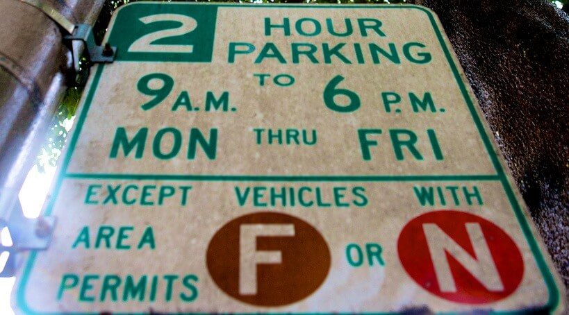
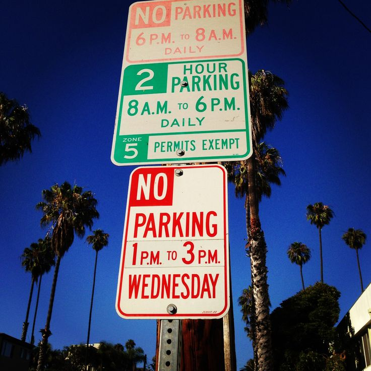
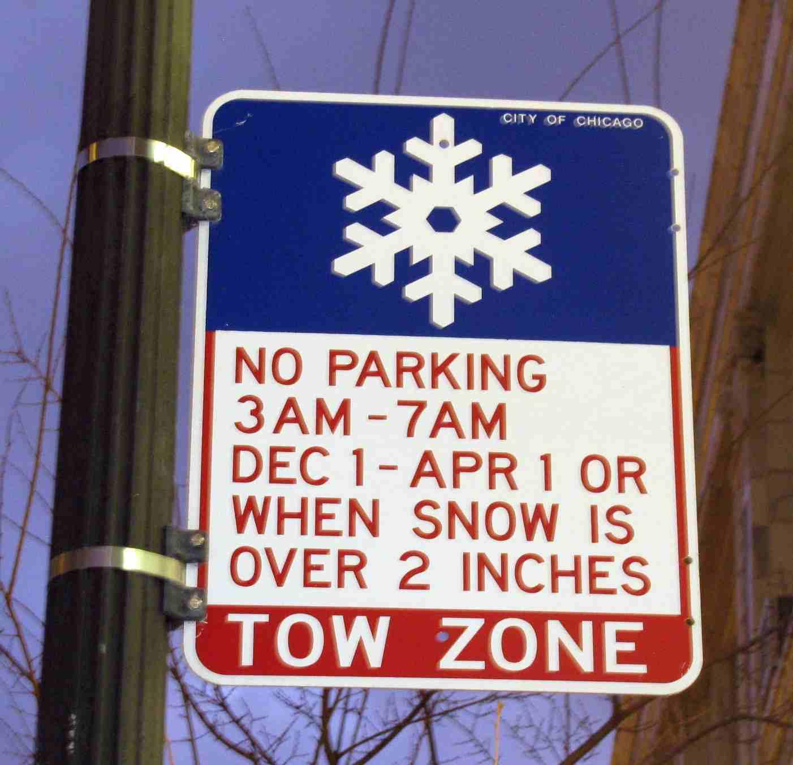
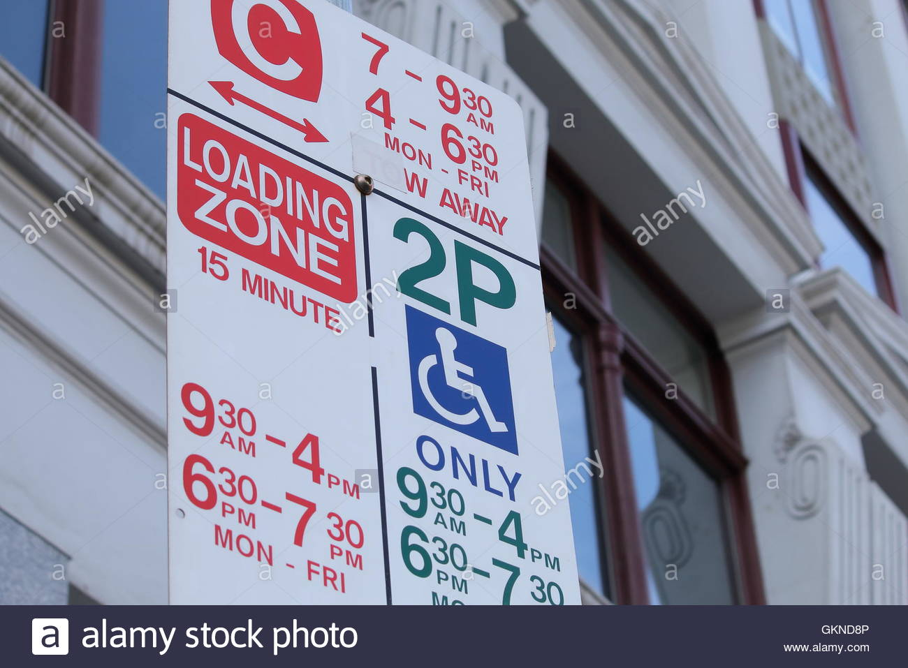
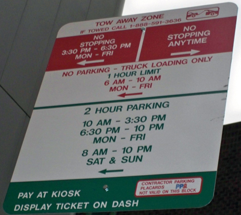
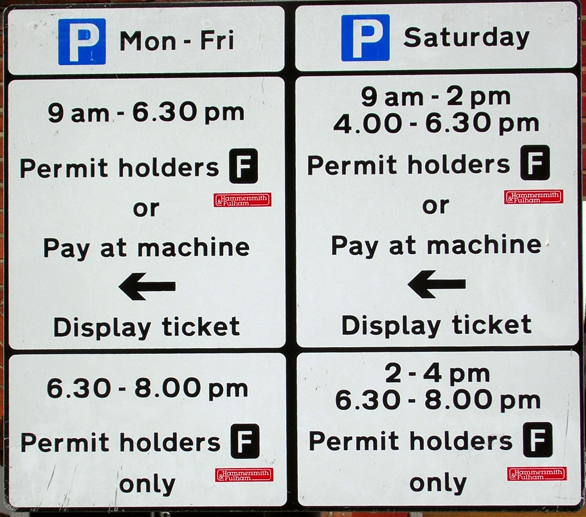
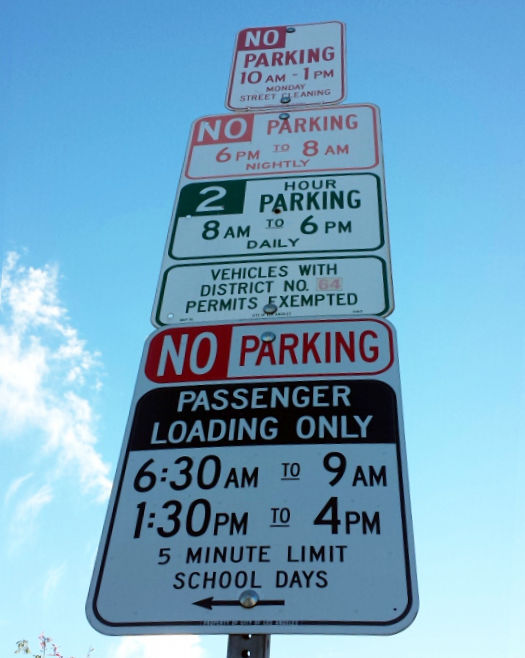

The examples below include the regulation described by the sign, as well as sample GeoJSON coordinates and location properties.


# Time limited parking with permit exemption, planned to take effect 2020-02-20
Any vehicle may park at this location, but vehicles without an 'F' or 'N' permit are limited to 2 hours between 9am and 6pm Monday through Friday. (The sign does not indicate whether parking is permitted outside of the specified time range - the "default" rule must be determined based on local context.)

### **Sign**



### **CurbLR**

```javascript
{
  "type": "Feature",
  "geometry": {
    "type": "LineString",
    "coordinates": [
      [-112.1258854, 33.4513431],
      [-112.1253007, 33.45132076]
    ]
  },
  "properties": {
    "location": {
      "shstRefId": "324af8ba918d9a2921b1fe6f9723d729",
      "shstLocationStart": 51,
      "shstLocationEnd": 55,
      "sideOfStreet": "right",
      "objectId": "87580",
      "derivedFrom": ["sign_452", "sign_204"],
      "marker": "sign",
      "streetName": "92nd St"
    },
    "regulations": [

      // defines a no standing zone for all other vehicles:
      {
        "rule": {
          "activity": "parking"
        },
        "userClasses": [
          {
            "classes": ["resident permit"],
            "subclasses": ["F", "N"]
          }
        ],
        "timeSpans": [
          {
            "daysOfWeek": {
              "days": ["mo", "tu", "we", "th", "fr"]
            },
            "timesOfDay": [
              {"from": "09:00", "to": "18:00"}
            ]
          }
        ],
        "priority": 5
      },
      {
        "rule": {
          "activity": "parking",
          "MaxStay": 120
        },
        "timeSpans": [
          {
            "daysOfWeek": {
              "days": ["mo", "tu", "we", "th", "fr"]
            },
            "timesOfDay": [
              {"from": "09:00","to": "18:00"}
            ]
          }
        ],
        "priority": 5
      }
    ],
    "images": [
      "https://raw.githubusercontent.com/sharedstreets/curblr/master/examples/images/time_limit_with_permit_exemption.jpg"
    ]
  }
}
```

# Time limited parking with permit exemption and multiple no parking periods
No vehicles may park between 6pm and 8am daily due to overnight parking restrictions, or between 1pm and 3pm on Wednesday for street cleaning. Between 8am and 6pm, vehicles without a Zone 5 permit are limited to two hours.

### **Sign**



### **CurbLR**

```javascript
{
  "type": "Feature",
  "geometry": {
    "type": "LineString",
    "coordinates": [
      [-119.258854, 32.513431],
      [-119.253007, 32.5132076]
    ]
  },
  "properties": {
    "location": {
      "shstRefId": "920af8ba918d9a2921b1fe6f9723d042",
      "shstLocationStart": 12,
      "shstLocationEnd": 105,
      "sideOfStreet": "right",
      "objectId": "94022",
      "derivedFrom": ["sign_820", "sign_028", "sign-940"],
      "marker": "sign",
      "streetName": "43rd St"
    },
    "regulations": [

      // No overnight parking:
      {
        "rule": {
          "activity": "no parking",
          "reason": "no overnight parking"
        },
        "timeSpans": [
          {
            "timesOfDay": [
              {"from": "18:00", "to": "23:59"},
              {"from": "00:00", "to": "08:00"}
            ]
          }
        ],
        "priority": 5
      },

      // Street cleaning on Wed from 1-3pm:
      {
        "rule": {
          "activity": "no parking",
          "reason": "street cleaning"
        },
        "timeSpans": [
          {
            "daysOfWeek": {
              "days": ["we"]
            },
            "timesOfDay": [
              {"from": "13:00", "to": "15:00"}
            ]
          }
        ],
        "priority": 3
      },

      // Zone 5 permit holders may park anytime between 8am and 6pm, every day:
      {
        "rule": {
          "activity": "parking"
        },
        "userClasses": [
          {
            "classes": ["permit"],
            "subclasses": ["zone 5"]
          }
        ],
        "timeSpans": [
          {
            "timesOfDay": [
              {"from": "08:00", "to": "18:00"}
            ]
          }
        ],
        "priority": 5
      },

      // All others may park between 8am and 6pm, with a 2-hour maximum stay:
      {
        "rule": {
          "activity": "parking",
          "maxStay": 120
        },
        "timeSpans": [
          {
            "timesOfDay": [
              {"from": "08:00", "to": "18:00"}
            ]
          }
        ],
        "priority": 5
      }
    ],
    "images": [
      "https://raw.githubusercontent.com/sharedstreets/curblr/master/examples/images/time_limit_with_permit_exemption_multiple.jpg"
    ]
  }
}
```


# No parking for snow removal (fixed and variable times)
Between December 1st and April 1st of each year, no one may park between 3am and 7am to facilitate snow removal. Parking is also prohibited when there is more than 2" of snow regardless of the time or date.

### **Sign**



### **CurbLR**

```javascript
{
  "type": "Feature",
  "geometry": {
    "type": "LineString",
    "coordinates": [
      [-119.258854, 32.513431],
      [-119.253007, 32.5132076]
    ]
  },
  "properties": {
    "location": {
      "shstRefId": "920af8ba918d9a2921b1fe6f9723d042",
      "shstLocationStart": 12,
      "shstLocationEnd": 105,
      "sideOfStreet": "right",
      "objectId": "94022",
      "derivedFrom": ["sign_820", "sign_028", "sign-940"],
      "marker": "sign",
      "streetName": "61st St"
    },
    "regulations": [

      // No parking that applies after a specific amount of snowfall:
      {
        "rule": {
          "activity": "no parking",
          "reason": "snow emergency zone"
        },
        "timeSpans": [
          {
            "designated_period": {
              "name": "Snow over 2 inches",
              "apply": "only during"
            }
          }
        ],
      "priority": 2
      },

      // No parking that applies during the winter regardless of snowfall:
      {
        "rule": {
          "activity": "no parking",
          "reason": "snow emergency zone"
        },
        "timeSpans": [
          {
            "effectiveDates": [
              {"from": "12-01", "to": "12-31"},
              {"from": "01-01", "to": "03-31"}
            ],
            "timesOfDay": [
              {"from": "03:00", "to": "07:00"}
            ]
          }
        ],
        "priority": 2
      }
    ],
    "images": [
      "https://raw.githubusercontent.com/sharedstreets/curblr/master/examples/images/snow_removal.jpg"
    ]
  }
}
```

# Dual allowed use and rush hour parking restriction
No vehicles may stop between 7am and 9:30am or between 4pm and 6:30pm Monday through Friday. From 9:30am to 4pm and from 6:30pm to 7:30pm Monday through Friday may be used as 2 hour parking for vehicles with a handicap placard or as a 15 minute loading zone for all others.

### **Sign**



### **CurbLR**

```javascript
{
  "type": "Feature",
  "geometry": {
    "type": "LineString",
    "coordinates": [
      [-119.258854, 32.513431],
      [-119.253007, 32.5132076]
    ]
  },
  "properties": {
    "location": {
      "shstRefId": "920af8ba918d9a2921b1fe6f9723d042",
      "shstLocationStart": 12,
      "shstLocationEnd": 105,
      "sideOfStreet": "right",
      "objectId": "94022",
      "derivedFrom": ["sign_820", "sign_028", "sign-940"],
      "marker": "sign",
      "streetName": "43rd St"
    },
    "regulations": [

      // Rush hour no stopping regulation (implies no loading and no parking):
      {
        "rule": {
          "activity": "no standing",
          "reason": "rush hour"
        },
        "timeSpans": [
          {
            "daysOfWeek": {
              "days": ["mo", "tu", "we", "th", "fr"]
            },
            "timesOfDay": [
              {"from": "07:00", "to": "09:30"},
              {"from": "16:00", "to": "18:30"}
            ]
          }
        ],
        "priority": 3
      },

      // Handicap parking regulation:
      {
        "rule": {
          "activity": "parking",
          "maxStay": 120
        },
        "userClasses": [
          {
            "classes": ["handicap"]
          }
        ],
        "timeSpans": [
          {
            "daysOfWeek": {
              "days": ["mo", "tu", "we", "th", "fr"]
            },
            "timesOfDay": [
              {"from": "09:30", "to": "16:00"},
              {"from": "18:30", "to": "19:30"}
            ]
          }
        ],
        "priority": 5
      },

      // Loading zone for all others:
      {
        "rule": {
          "activity": "loading",
          "reason": "loading zone",
          "maxStay": 15
        },
        "timeSpans": [
          {
            "daysOfWeek": {
              "days": ["mo", "tu", "we", "th", "fr"]
            },
            "timesOfDay": [
              {"from": "09:30", "to": "16:00"},
              {"from": "18:30", "to": "19:30"}
            ]
          }
        ],
        "priority": 5
      }
    ],
    "images": [
      "https://raw.githubusercontent.com/sharedstreets/curblr/master/examples/images/dual_use_rush_hour.jpg"
    ]
  }
}
```

# Complex time and user dependent regulations
No vehicles may stop between 3:30pm and 6:30pm Monday through Friday. Truck loading zone only between 6am and 10am Monday through Friday with a one hour limit. Two hour parking allowed between 10am and 3:30pm Monday through Friday, 6:30pm and 10pm Monday through Friday, and 8am to 10pm Saturday and Sunday.

### **Sign**



### **CurbLR**

```javascript
{
  "type": "Feature",
  "geometry": {
    "type": "LineString",
    "coordinates": [
      [-119.258854, 32.513431],
      [-119.253007, 32.5132076]
    ]
  },
  "properties": {
    "location": {
      "shstRefId": "920af8ba918d9a2921b1fe6f9723d042",
      "shstLocationStart": 12,
      "shstLocationEnd": 105,
      "sideOfStreet": "right",
      "objectId": "94022",
      "derivedFrom": ["sign_820", "sign_028", "sign-940"],
      "marker": "sign",
      "streetName": "43rd St"
    },
    "regulations": [

      // No stopping on weekday afternoons:
      {
        "rule": {
          "activity": "no standing",
        },
        "timeSpans": [
          {
            "daysOfWeek": {
              "days": ["mo", "tu", "we", "th", "fr"]
            },
            "timesOfDay": [
              {"from": "15:30", "to": "18:30"}            
            ]
          }
        ],
        "priority": 5
      },

      // Weekday morning truck loading zone (implies no loading and no parking for all others):
      {
        "rule": {
          "activity": "loading",
          "maxStay": 60
        },
        "userClasses": [
          {
            "classes": ["truck"]
          }
        ],
        "timeSpans": [
          {
            "daysOfWeek": {
              "days": ["mo", "tu", "we", "th", "fr"]
            },
            "timesOfDay": [
              {"from": "06:00", "to": "10:00"}            
            ]
          }
        ],
        "priority": 5
      },

      // Two-hour parking at specific days and times:
      {
        "rule": {
          "activity": "parking",
          "maxStay": 120
        },

        // (weekday allowed parking):
        "timeSpans": [
          {
            "daysOfWeek": {
              "days": ["mo", "tu", "we", "th", "fr"]
            },
            "timesOfDay": [
              {"from": "10:00", "to": "10:30"},
              {"from": "18:30", "to": "22:00"}
            ]
          },
          // (weekend allowed parking):
          {
            "daysOfWeek": {
              "days": ["sa", "su"]
            },
            "timesOfDay": [
              {"from": "08:00", "to": "22:00"}            
            ]
          }
        ],
        "priority": 5
      }
    ],
    "images": [
      "https://raw.githubusercontent.com/sharedstreets/curblr/master/examples/images/complex_time_use.jpg"
    ]
  }
}
```

# Combination permit only and meter parking with user-specific payment rules
Only vehicles with a Zone F permit may park from 6:30pm to 8:00pm Monday through Saturday, and from 2pm to 4pm on Saturday. Anyone may park from 9am until 6:30pm Monday through Friday, and from 9am to 2pm and 4pm to 6:30pm on Saturday, but vehicles without a Zone F permit must pay.

### **Sign**



### **CurbLR**

```javascript
{
  "type": "Feature",
  "geometry": {
    "type": "LineString",
    "coordinates": [
      [-119.258854, 32.513431],
      [-119.253007, 32.5132076]
    ]
  },
  "properties": {
    "location": {
      "shstRefId": "920af8ba918d9a2921b1fe6f9723d042",
      "shstLocationStart": 12,
      "shstLocationEnd": 105,
      "sideOfStreet": "right",
      "objectId": "94022",
      "derivedFrom": ["sign_820", "sign_028", "sign-940"],
      "marker": "sign",
      "streetName": "43rd St"
    },
    "regulations": [

      // Permit parking only:
      {
        "rule": {
          "activity": "parking",
        },
        "userClasses": [
          {
            "classes": ["permit"],
            "subclasses": ["zone F"]
          }
        ],
        "timeSpans": [
          {
            "daysOfWeek": {
              "days": ["mo", "tu", "we", "th", "fr", "sa"]
            },
            "timesOfDay": [
              {"from": "18:30", "to": "20:00"}            
            ]
          },
          {
            "daysOfWeek": {
              "days": ["sa"]
            },
            "timesOfDay": [
              {"from": "14:00", "to": "16:00"}
            ]
          }
        ],
        "priority": 5
      },

      // Free daytime parking for permit holders:
      {
        "rule": {
          "activity": "parking",
          "payment": false  // this is the default, but specified here for clarity
        },
        "userClasses": [
          {
            "classes": ["permit"],
            "subclasses": ["zone F"]
          }
        ],
        "timeSpans": [
          {
            "daysOfWeek": {
              "days": ["mo", "tu", "we", "th", "fr"]
            },
            "timesOfDay": [
              {"from": "09:00", "to": "18:30"}            
            ]
          },
          {
            "daysOfWeek": {
              "days": ["sa", "su"]
            },
            "timesOfDay": [
              {"from": "09:00", "to": "14:00"},
              {"from": "16:00", "to": "18:30"}
            ]
          }
        ],
        "priority": 5
      },

      // Paid daytime parking for everyone else:
      {
        "rule": {
          "activity": "parking",
          "payment": true
        },
        "timeSpans": [
          {
            "daysOfWeek": {
              "days": ["mo", "tu", "we", "th", "fr"]
            },
            "timesOfDay": [
              {"from": "09:00", "to": "18:30"}            
            ]
          },
          {
            "daysOfWeek": {
              "days": ["sa", "su"]
            },
            "timesOfDay": [
              {"from": "09:00", "to": "14:00"},
              {"from": "16:00", "to": "18:30"}
            ]
          }
        ],
        "priority": 5
      }
    ],
    "images": [
      "https://raw.githubusercontent.com/sharedstreets/curblr/master/examples/images/permit_meter_complex_payment.jpg"
    ]
  }
}
```

# School loading zone, time limited parking with permit exemption, and multiple no parking periods
On school days only 5 minute passenger loading is permitted from 6:30am to 9am and from 1:30pm to 4pm. No vehicles may park between 6pm and 8am daily due to overnight parking restrictions, or between 10am and 1pm on Monday for street cleaning. Between 8am and 6pm, vehicles without a Zone 64 permit are limited to 2 hours.

_[Editor's Note: The school day regulation overlaps with both the overnight no parking and the 2-hour allowed parking regulations. To avoid ambiguity about which rule is in effect, the school day regulation is given a higher priority than the other regulations.]_

### **Sign**



### **CurbLR**

```javascript
{
  "type": "Feature",
  "geometry": {
    "type": "LineString",
    "coordinates": [
      [-119.258854, 32.513431],
      [-119.253007, 32.5132076]
    ]
  },
  "properties": {
    "location": {
      "shstRefId": "920af8ba918d9a2921b1fe6f9723d042",
      "shstLocationStart": 12,
      "shstLocationEnd": 105,
      "sideOfStreet": "right",
      "objectId": "94022",
      "derivedFrom": ["sign_820", "sign_028", "sign-940"],
      "marker": "sign",
      "streetName": "43rd St"
    },
    "regulations": [

      // School day loading regulation:
      {
        "rule": {
          "activity": "loading",
          "reason": "school pick-up and drop-off only",
          "maxStay": 5
        },
        "userClasses": [
          {
            "classes": ["passenger"]
          }
        ],
        "timeSpans": [
          {
            "designatedPeriod": {
              "name": "school days",
              "apply": "only during"
            },
            "daysOfWeek": {
              "days": ["mo", "tu", "we", "th", "fr"]   // This is implied in the "designated period", but included for clarity
            },
            "timesOfDay": [
              {"from": "06:30", "to": "09:00"},
              {"from": "13:30", "to": "16:00"}
            ]
          }
        ],
        "priority": 4 // This is rule overlaps with regular parking areas, so we use priority level 4 to distinguish it
      },

      // Overnight parking regulation:
      {
        "rule": {
          "activity": "no parking",
        },
        "timeSpans": [
          {
            "timesOfDay": [
              {"from": "18:00", "to": "23:59"},
              {"from": "00:00", "to": "08:00"}
            ]
          }
        ],
        "priority": 5
      },

      // Street cleaning regulation:
      {
        "rule": {
          "activity": "no parking",
          "reason": "street cleaning"
        },
        "timeSpans": [
          {
            "daysOfWeek": {
              "days": ["mo"]
            },
            "timesOfDay": [
              {"from": "10:00", "to": "13:00"}
            ]
          }
        ],
        "priority": 3
      },

      // Zone 64 allowed parking

      {
        "rule": {
          "activity": "parking",
        },
        "userClasses": [
          {
            "classes": ["permit"],
            "subclasses": ["zone 64"]
          }
        ],
        "timeSpans": [
          {
            "timesOfDay": [
              {"from": "08:00", "to": "18:00"},
            ]
          }
        ],
        "priority": 5
      },

      // Time-limited parking for everyone else
      {
        "rule": {
          "activity": "parking",
          "maxStay": 120
        },
        "timeSpans": [
          {
            "timesOfDay": [
              {"from": "08:00", "to": "18:00"}
            ]
          }
        ],
        "priority": 5
      }
    ],
    "images": [
      "https://raw.githubusercontent.com/sharedstreets/curblr/master/examples/images/tower_of_signs.jpg"
    ]
  }
}
```
