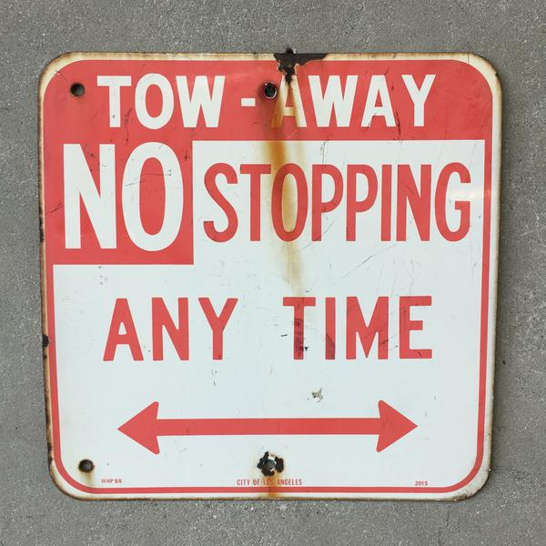
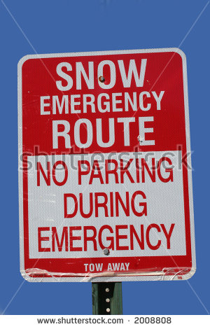
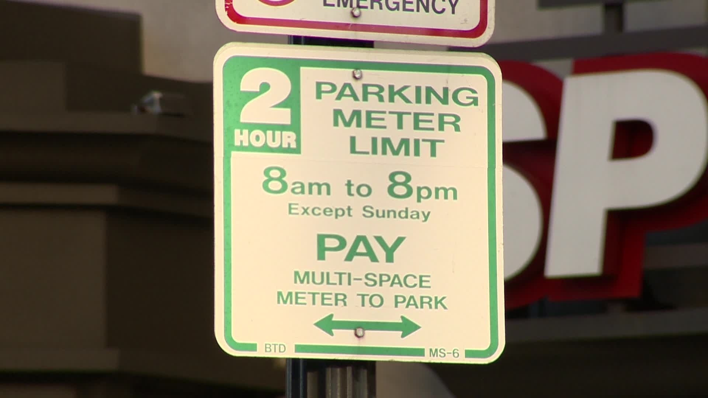
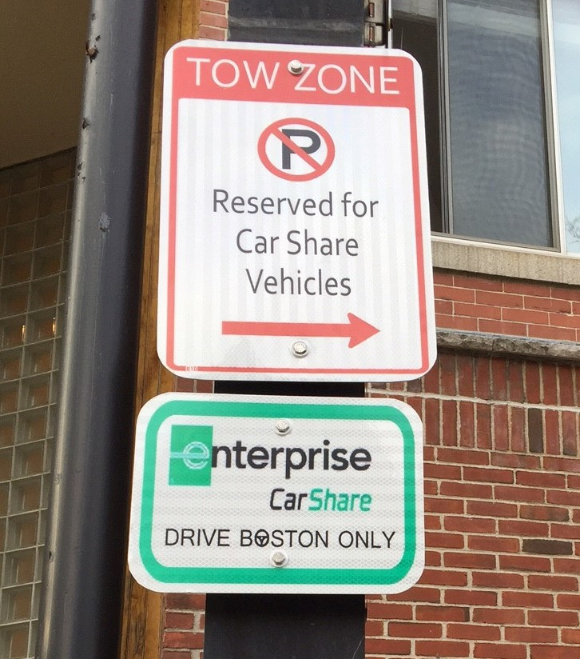
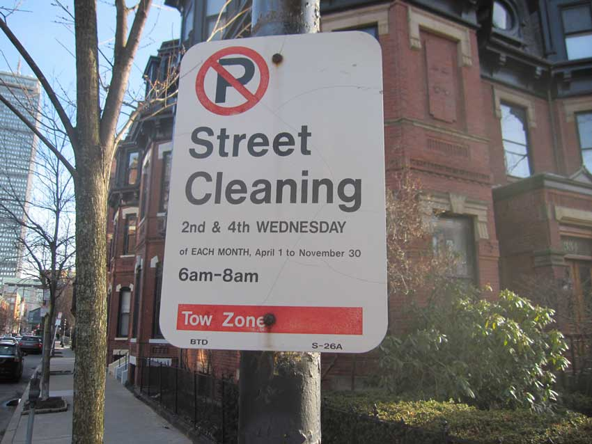
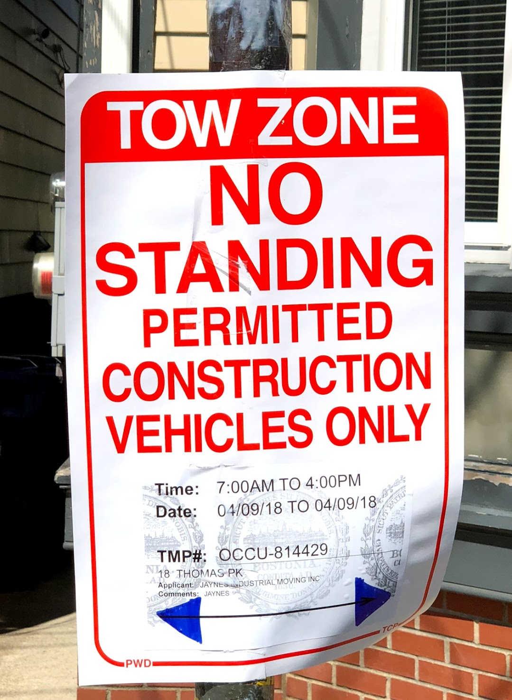
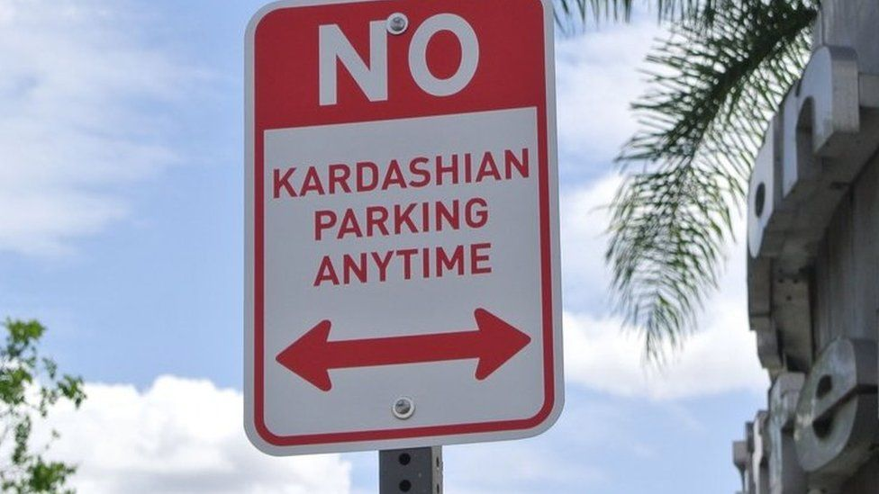

The examples below include the regulation described by the sign, as well as sample GeoJSON coordinates and location properties.

# No stopping

No stopping is allowed by anyone at any time. Example location information is included.

### **Sign**



### **CurbLR**
```javascript
{
  "type": "Feature",
  "geometry": {
    "type": "LineString",
    "coordinates": [
      [-112.125885,33.451343],
      [-112.125300,33.451320]
    ]
  },
  "properties": {
    "location": {
        "shstRefId": "324af8ba918d9a2921b1fe6f9723d729",
        "shstLocationStart": 51.6,
        "shstLocationEnd": 55.6,
        "sideOfStreet": "right",
        "objectId": "59463",
        "derivedFrom": ["b2045", "d0294"],
        "assetType": "sign",
        "streetName": "Madison Ave"
    },
    "regulations": [
      {
        "rule": {
          "activity": "no stopping",
          "reason": "tow-away zone"
        },
        "priority": 4
      }
    ],
    "images": [
      "https://raw.githubusercontent.com/sharedstreets/curblr/master/examples/images/no_stopping.jpg"
    ]
  }
}
```

# Snow emergency
No one may park during snow emergencies. Example location information is included.

### **Sign**



### **CurbLR**

```javascript
{
  "type": "Feature",
  "geometry": {
    "type": "LineString",
    "coordinates": [
      [-115.1258854,32.4513434],
      [-115.1253007,32.4513207]
    ]
  },
  "properties": {
    "location": {
        "shstRefId": "324af8ba918d9a2921b1fe6f9723d729",
        "shstLocationStart": 29.9,
        "shstLocationEnd": 34.1,
        "sideOfStreet": "left",
        "objectId": "49202",
        "derivedFrom": ["ks045", "q9372"],
        "assetType": "sign",
        "streetName": "Parkdale St"
      },
    "regulations": [
      {
        "rule": {
          "activity": "no parking",
          "reason": "snow emergency zone"
        },
        "timeSpans": [
          {
            "designatedPeriod": {
              "name": "snow emergency",
              "apply": "only during"
            }
          }
        ],
        "priority": 2
      }
    ],
    "images": [
      "https://raw.githubusercontent.com/sharedstreets/curblr/master/examples/images/snow_emergency.jpg"
    ]
  }
}
```

# Time-limited meter parking
Parking is limited to two hours between 8am and 8pm Monday through Saturday. Payment at multi-space meter is required.

### **Sign**



### **CurbLR**

```javascript
{
  "type": "Feature",
  "geometry": {
    "type": "LineString",
    "coordinates": [
      [-115.1258854,32.4513434],
      [-115.1253007,32.4513207]
    ]
  },
  "properties": {
    "location": {
        "shstRefId": "324af8ba918d9a2921b1fe6f9723d729",
        "shstLocationStart": 40,
        "shstLocationEnd": 60,
        "sideOfStreet": "right",
        "objectId": "2945",
        "derivedFrom": ["kj045", "o9372"],
        "assetType": "sign",
        "streetName": "Mission St"
      },
    "regulations": [
      {
        "rule": {
          "activity": "parking",
          "payment": true
        },
        "timeSpans": [
          {
            "daysOfWeek": {
              "days": ["mo", "tu", "we", "th", "fr", "sa"]
            },
            "timesOfDay": [
              {"from": "08:00", "to": "20:00"}
            ]
          }
        ],
        {
          "payment":{
            "devices": ["meter"]
          }
        }
        "priority": 5
      }
    ],
    "images": [
      "https://raw.githubusercontent.com/sharedstreets/curblr/master/examples/images/meter_parking_time_limit.jpg"
    ]
  }
}
```


# Car share vehicles
Only Enterprise CarShare vehicles may park. All others are prohibited at all times (this is implied and does not need to be specified).

### **Sign**



### **CurbLR**

```javascript
{
  "type": "Feature",
  "geometry": {
    "type": "LineString",
    "coordinates": [
      [-112.125885,33.451343],
      [-112.125300,33.451320]
    ]
  },
  "properties": {
    "location": {
        "shstRefId": "908af8ba918d9a2921b1fe6f9723d729",
        "shstLocationStart": 14.7,
        "shstLocationEnd": 19.0,
        "sideOfStreet": "right",
        "objectId": "40163s",
        "derivedFrom": ["wo3045", "ty7649"],
        "assetType": "sign",
        "streetName": "Reed Ave"
      },
    "regulations": [
      {
        "rule": {
          "activity": "parking",
          "reason": "car share only"
        },
        "userClasses" : [
          {
            "classes": ["car share"],
            "subclasses": ["Enterprise"]
          }
        ],
        "priority": 5
      }
    ],
    "images": [
      "https://raw.githubusercontent.com/sharedstreets/curblr/master/examples/images/car_share.jpg"
    ]
  }
}
```

# Seasonal street cleaning
No parking allowed between 6am and 8am on the 2nd and 4th Wednesday of each month between April 1st and November 30th of every year.

### **Sign**



### **CurbLR**

```javascript
{  
  "type": "Feature",
  "geometry": {
    "type": "LineString",
    "coordinates": [
      [-126.1258854,33.4513431],
      [-126.1253029,33.4513429]
    ]
  },
  "properties": {
    "location": {
        "shstRefId": "923af8ba918d9a2921b1fe6f9723d729",
        "shstLocationStart": 5,
        "shstLocationEnd": 90,
        "sideOfStreet": "right",
        "objectId": "d59463",
        "derivedFrom": ["sign-7369", "sign-1045"],
        "assetType": "sign",
        "streetName": "Brookline St"
      },
    "regulations": [
      {
        "rule": {
          "activity": "no parking",
          "reason": "street cleaning"
        },
        "timeSpans": [
          {
            "effectiveDates": [
              {"from": "04-01", "to": "11-30"}
            ],
            "daysOfWeek": {
              "days": ["We"],
              "occurrencesInMonth": ["2nd", "4th"]
            },
            "timesOfDay": [
              {"from": "06:00", "to": "08:00"}
            ]
          }
        ],
        "priority": 3
      }
    ]
    "images": [
      "https://raw.githubusercontent.com/sharedstreets/curblr/master/examples/images/street_cleaning.jpg"
    ]
  }
}
```

# Temporary construction zone
All vehicles except permitted construction vehicles are prohibited from standing between 7am and 4pm on April 9th, 2018.

### **Sign**



### **CurbLR**

```javascript
{  
  "type": "Feature",
  "geometry": {
    "type": "LineString",
    "coordinates": [
      [-129.1258854,33.4513431],
      [-129.1253007,33.4513207]
    ]
  },
  "properties": {
    "location": {
        "shstRefId": "224af8ba918d9a2921b1fe6f9723d729",
        "shstLocationStart": 20.3,
        "shstLocationEnd": 25.8,
        "sideOfStreet": "right",
        "objectId": "d59463",
        "derivedFrom": ["sign-9769", "sign-2045"],
        "assetType": "sign",
        "streetName": "Madison Ave"
      },
    "regulations": [

      // defines a parking zone for construction vehicles:
      {
        "rule": {
          "activity": "parking",
          "reason": "construction vehicles only"
        },
        "userClasses" : [
          {
            "classes": ["construction"]
          }
        ],
        "timeSpans": [
          {
            "effectiveDates": [
              {"from": "2018-04-09", "to": "2018-04-09"}
            ],
            "timesOfDay": [
              {"from": "07:00", "to": "16:00"}
            ]
          }
        ],
        "priority": 3
      },

      // defines a no standing zone for all other vehicles:
      {
        "rule": {
          "activity": "standing",
          "reason": "construction vehicles only"
        },
        "userClasses" : [
          {
            "classes": ["construction"]
          }
        ],
        "timeSpans": [
          {
            "effectiveDates": {
              "from": "2018-04-09","to": "2018-04-09"
            },
            "timesOfDay": [
              {"from": "07:00", "to": "16:00"}
            ]
          }
        ],
        "priority": 3
      }
    ],
    "images": [
      "https://raw.githubusercontent.com/sharedstreets/curblr/master/examples/images/temporary_construction_zone.jpg"
    ]
  }
}
```


# Resident parking
Parking allowed only for resident permit holders Monday through Saturday, except holidays.

### **Sign**


### **CurbLR**

```javascript
{
  "type": "Feature",
  "geometry": {
    "type": "LineString",
    "coordinates": [
      [-113.1258851,32.4513431],
      [-113.1253007,32.4513207]
    ]
  },
  "properties": {
    "location": {
        "shstRefId": "993dj8ba408d9a2921b1fe6f9723d729",
        "shstLocationStart": 5,
        "shstLocationEnd": 100,
        "sideOfStreet": "right",
        "objectId": "190-349s",
        "derivedFrom": ["w0434", "q9404"],
        "assetType": "sign",
        "streetName": "Bond St"
      },
    "regulations": [
      {
        "rule": {
          "activity": "parking",
        },
        "userClasses" : [
          {
            "classes": ["permit"],
          }
        ],
        "timeSpans": [
          {
            "daysOfWeek": {
              "days": ["mo", "tu", "we", "th", "fr", "sa"]
            },
            "designatedPeriods": [
              {"name": "holidays", "apply": "except during"}
            ]
          }
        ],
        "priority": 5
      }  
    ],
    "images": [
      "https://raw.githubusercontent.com/sharedstreets/curblr/master/examples/images/resident_parking.jpg"
    ]
  }
}
```

# Prohibit specific users
No parking for Kardashians at any time. Let's pretend this sign is not yet in place, but proposed for consideration.

### **Sign**



### **CurbLR**

```javascript
{
  "type": "Feature",
  "geometry": {
    "type": "LineString",
    "coordinates": [
      [-113.1258851,32.4513431],
      [-113.1253007,32.4513207]
    ]
  },
  "properties": {
    "location": {
        "shstRefId": "993dj8ba408d9a2921b1fe6f9723d729",
        "shstLocationStart": 5,
        "shstLocationEnd": 100,
        "sideOfStreet": "right",
        "objectId": "190-349s",
        "derivedFrom": ["w0434", "q9404"],
        "assetType": "sign",
        "streetName": "Celebrity St",
        "status": "proposed"
      },
    "regulations": [
      {
        "rule": {
          "activity": "no parking",
        },
        "userClasses" : [
          {
            "classes": ["Kardashians"],
          }
        ],
        "priority": 5
      }  
    ],
    "images": [
      "https://raw.githubusercontent.com/sharedstreets/curblr/master/examples/images/no_kardashians.jpg"
    ]
  }
}
```
